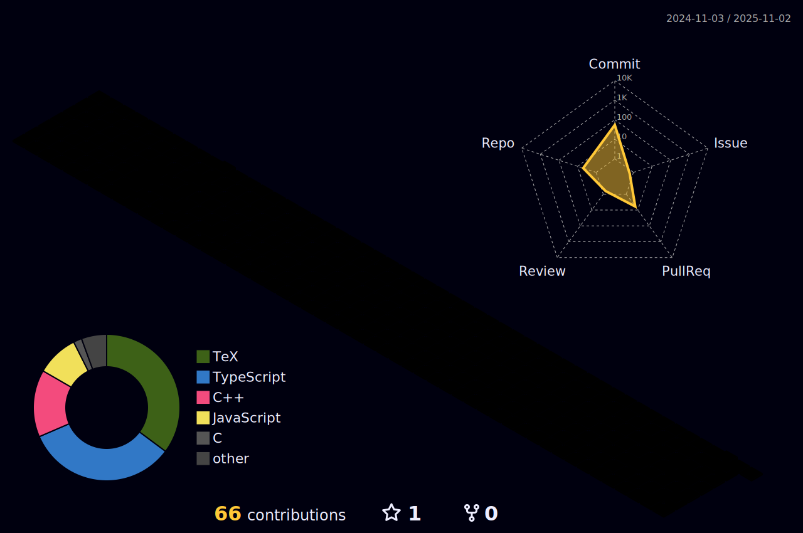

# 自己紹介
制御情報工学科の2年生

# 経歴
## 小学生
### 2020年1月 - 静岡県diff(静岡県プロコン)
- 小学生の部優秀賞

## 高専生
### 2024年8月 - RIMS共同研究
「数学ソフトウェアとその効果的教育利用に関する研究」にて発表
### 2024年10月 - 高専プロコン出場
競技部門で1回戦6位-敗者復活1位-準決勝6位

#スキル等
Python,BASIC,TeX等々

